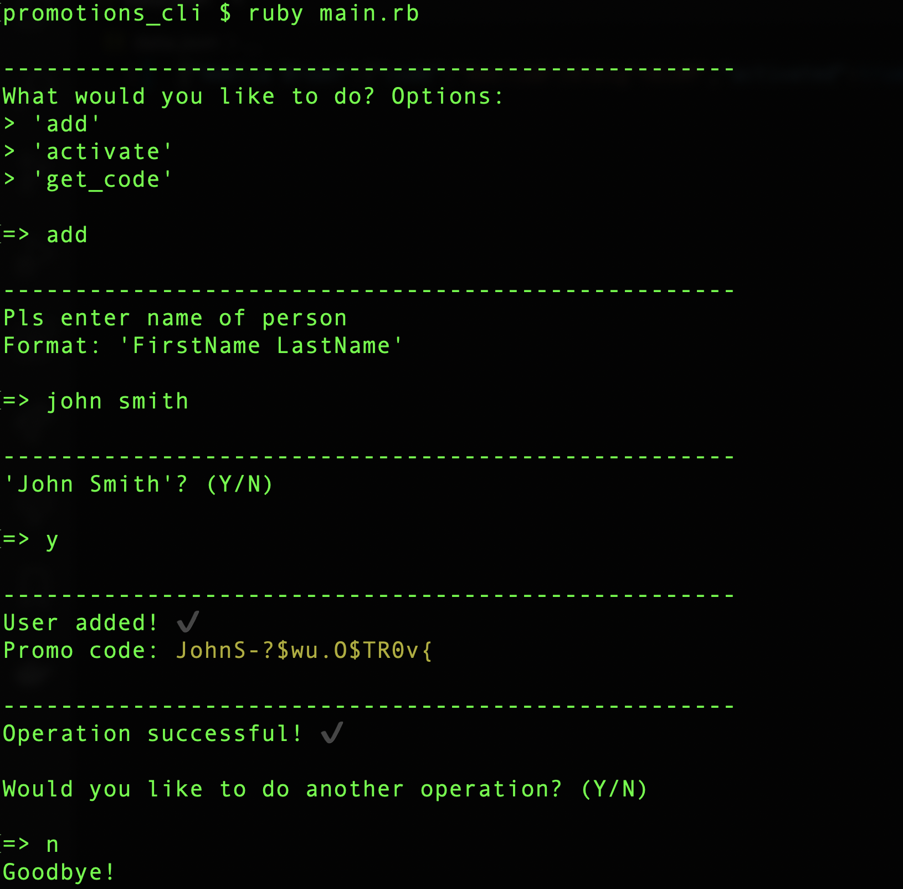

# Custom Promotion Code Generator
Customized promotion code generator that maps a name to a specific promotion code

Built with native Ruby code (no external gems)

<div align="center">
  
</div>

## Run
```
ruby main.rb
```

## File Anatomy
- `main.rb`
  - Main script
- `helpers.rb`
  - `main.rb`'s helper functions:
    - `add()`
    - `activate()`
    - `get_code()`
- `utils.rb`
  - Smaller repeated functions such as `get_name()` and `print_seperator()`
- `data.json`
  - Where promotion code information gets stored
  - Changes to it not tracked by `git` for your safety
    - Done through running `git update-index --skip-worktree <file-name>`

## Promotion Code Generation Algorithm
```Ruby
def create_prm_code(name)
  chars = ('!'..'~').to_a # 92 uniq chars
  chars[1] = 'A' ; chars[59] = 'B' # Removing chars that may cause form failure ("\"" and "\\")

  code = [*chars, *chars].sample(12).join('')
  code = name.split(' ')[0] + name.split(' ')[1][0] + '-' + code

  return code
end
```
The more you increase the sample size (i.e. `sample(n)`), the harder
it would be to crack your promotion code

`chars` has 92 unique characters and includes upper-case/lower-case letters, numbers, and some special characters
  
Through testing on [security.org](www.security.org), I found that it typically takes 10k+ years to crack these codes. But this is not a guarantee. You may want to [test it](https://www.security.org/how-secure-is-my-password/) yourself as well


## JSON Data Structure
```JSON
"<FirstName LastName>": {
  "code": "String: Generated code",
  "activated": "Boolean"
}
```

Example:
```JSON
"John Smith": {
  "code": "JohnS-%E>aoLJ%b&qC",
  "activated": true
}
```

## License
[MIT](https://choosealicense.com/licenses/mit/)
